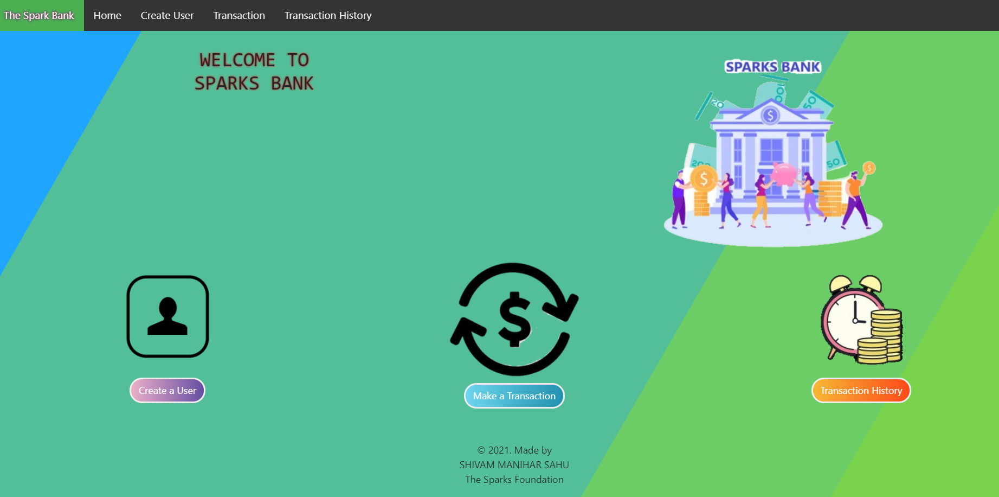

# Basic_Banking_System

### Sparks Foundation Project : Basic Banking System
A Web Application used to transfer money between multiple users (Project contains few dummy users). A dummy user can also be created.

#### Go to website: http://spark-foundation.mywebcommunity.org/index.php

## Flow of the Website: 
* Home Page -> View all Users -> Select and View one User -> Transfer Money -> Select reciever -> View all Users -> View Transfer History.

## Features

1. Responsive and User friendly UI, easy to use.
2. Home page of Banking System 
   * Containing different buttons for operations.
   * Create User.
   * View All customers
   * Transaction history. 
3. Create User Page
   * Registration for new user details.
4. View All customers
   * > View all the registered customers in website. 
       >> You can see profile of every customers by clicking view profile 
5. Transaction History
   * You can see all the transaction history on this page. 


#### Database contains two Tables- Users Table & Transaction Table

---
## Website Pic

## Technology stacks used in project: Web Technology
*  Frontend
   * HTML
   * CSS
   * JS
   * Bootstrap
*  Tools
   * Git
   * Github
   * Php
   * Php MyAdmin
*  Backend
   * Apache Server
   * MySql
*  Execution of project
   * Apache Server, using XAMPP
   
## Instruction to USE web application

*  Download the zip file or clone this repo using following command
   
     ``` bash
         git clone https://github.com/shivammaniharsahu/basic_banking_system.git
     ```
*  Install XAMPP to run server by this link
     ``` bash
         https://www.apachefriends.org/download.html
     ```    
         
*  Go to directory C:\xampp\htdocs\
     ``` bash
         Paste here cloned project(Unzipped File) 
     ```
*  Import SQL file into phpMyAdmin (spark_foundation.sql)

*  Run XAMPP server by opening XAMPP application
     ``` bash
         Run Apache module.
         For Php MyAdmin run MySQL server. 
     ```     
*  Run the project on local server by this link
     ``` bash
         http://localhost/templates/index.php
     ```  
*  Hurrey! 😎, Our project running on localhost  

## Php MyAdmin

*  Added spark_foundation.sql database, where we can find created db in our project.

---
     
 
